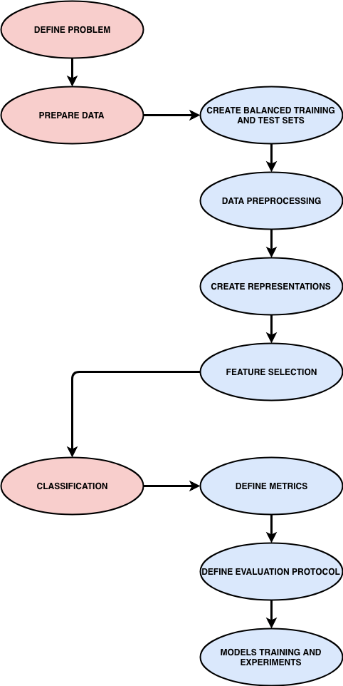
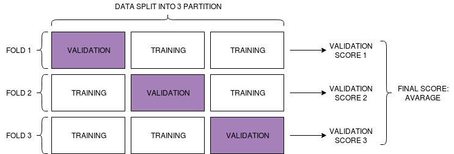

# Data Mining & Search - Machine Learning for Text Classification in R

## Outline

<center>

</center>

## Step 0 - Install & Import Packages
### Install Packages
We will be using the R packages "caret" and "tm" to parse and machine-read the data and then subsequently train models.

```{r}
# install.packages("kernlab")
# install.packages("caret")
# install.packages("tm")
# install.packages("dplyr")
# install.packages("splitstackshape")
# install.packages("e1071")
# install.packages("textclean")
# install.packages("mgsub")
# install.packages("tictoc")
# install.packages("klaR")
# install.packages("promises")
# install.packages("C50")
# install.packages("inum")
```

### Import Packages
```{r}
library("dplyr")
library(data.table)
library("lattice")
library("ggplot2")
library("textclean")
library("mgsub")
library("stringi")
library("kernlab")
library("caret")
library("tm")
library("dplyr")
library("splitstackshape")
library("e1071")
library("tictoc")
```

## Step 1 - Import & Preprocess Data
### Import Dataset
In this tutorial we use the **Reuters dataset**, which is a well-known dataset composed of several texts and used for **text classification** research.

Reuters is an international business and financial news agency.

The news in the dataset are labelled according to their topics.

The most populated topics are:

1. **acq:** Mergers/Acquisitions;
2. **earn:** Earnings and Earnings Forecasts;
3. **money.fx:** Money/Foreign Exchange.

```{r}
# Import dataset from csv
dataset <- fread("reuters_dataset.csv", encoding = 'UTF-8')

# Print length of the most populated topics (classes) in the dataset
cat('topic.acq', length(which(dataset$topic.acq == 1)), '\n')
cat('topic.earn', length(which(dataset$topic.earn == 1)), '\n')
cat('topic.money.fx', length(which(dataset$topic.money.fx == 1)), '\n')
```

As you can see the three classes have different cardinalities.

### Create Balanced Training and Test Sets

It is a good practice in Machine Learning to use only _balanced_ datasets.
A **balanced dataset** is a dataset composed of an equal number of samples per class.

For this reason we want to compose a new balanced dataset, conatining only articles regarding the three most popular topics in the original dataset.

Another good practice is to divide the dataset into two subsets: **training set** and **test set**.

1. **Training set:** The sample of data used to _fit_ the model. The actual dataset that we use to _train_ the model. The model sees and learns from this data. (Usually 75/80% of the dataset)

2. **Test set:** The sample of data used to provide an unbiased evaluation of a final model fit on the training dataset. The Test dataset provides the _gold standard_ used to evaluate the model. It is only used once a model is completely trained. (The rest of the dataset - 20/25%)

```{r}
# Create a new dataset containing only articles related to acq, earn and money.fx
three_class_dataset = dataset[
  (dataset$topic.acq == 1 & dataset$topic.earn == 0 & dataset$topic.money.fx == 0)
  | (dataset$topic.acq == 0 & dataset$topic.earn == 1 & dataset$topic.money.fx == 0)
  | (dataset$topic.acq == 0 & dataset$topic.earn == 0 & dataset$topic.money.fx == 1)]
```

```{r}
# Take 800 articles from acq
acq_dataset = three_class_dataset[three_class_dataset$topic.acq == 1]
acq_dataset_800 = acq_dataset[1:800,]
acq_dataset_800 = select(acq_dataset_800, pid, doc.text)
```

```{r}
# Take 600 acq articles for the training dataset
train_acq_dataset = acq_dataset_800[1:600,]
```

```{r}
# Take 200 acq articles for the test dataset
test_acq_dataset = acq_dataset_800[601:800,]
```

```{r}
# Take 800 articles from earn
earn_dataset = three_class_dataset[three_class_dataset$topic.earn == 1]
earn_dataset_800 = earn_dataset[1:800,]
earn_dataset_800 = select(earn_dataset_800, pid, doc.text)
```

```{r}
# Take 600 acq articles for the training dataset
train_earn_dataset = earn_dataset_800[1:600,]

# Take 200 acq articles for the test dataset
test_earn_dataset = earn_dataset_800[601:800,]
```

```{r}
# Take 800 articles from earn
money_fx_dataset = three_class_dataset[three_class_dataset$topic.money.fx == 1]
money_fx_dataset_800 = money_fx_dataset[1:800,]
money_fx_dataset_800 = select(money_fx_dataset_800, pid, doc.text)

# Take 600 acq articles for the training dataset
train_money_fx = money_fx_dataset_800[1:600,]
```

```{r}
# Take 200 acq articles for the test dataset (we skip one as it causes problems...)
test_money_fx_1 = money_fx_dataset_800[601:696,]
test_money_fx_2 = money_fx_dataset_800[698:801,]
```

```{r}
# Put the parts togheter and create the training set
train_set <- rbind(train_acq_dataset, train_earn_dataset, train_money_fx)
```

```{r}
# Put the parts togheter and create the test set
test_set <- rbind(test_acq_dataset, test_earn_dataset, test_money_fx_1, test_money_fx_2)
```

```{r}
# Rename columns
colnames(train_set)[1] <- "doc_id"
colnames(train_set)[2] <- "text"
colnames(test_set)[1] <- "doc_id"
colnames(test_set)[2] <- "text"
```

```{r}
# Print training and test set cardinalities in order to check if they respect the ratio
cat('train_set cardinality: ', lengths(train_set), '\n', 'test_set cardinality: ', lengths(test_set), '\n')
```

### Preprocess Data

As we have two sets of samples (training and test sets) it's preferable to define a function for data preprocessing so that it can be reused on occurrence.

```{r}
# Data Preprocessing
preprocess_dataset <- function(set) {
  corpus <- VCorpus(DataframeSource(set))
  # Strip white spaces at the beginning and at the end to overcome some problems
  corpus <- tm_map(corpus, content_transformer(stripWhitespace))
  # User replace_contraction function from textclean package
  corpus <- tm_map(corpus, content_transformer(replace_contraction))
  corpus <- tm_map(corpus, content_transformer(tolower))
  corpus <- tm_map(corpus, content_transformer(removePunctuation))
  corpus <- tm_map(corpus, content_transformer(removeNumbers))
  corpus <- tm_map(corpus, stemDocument, language = "english")
  corpus <- tm_map(corpus, removeWords, stopwords("english"))
  corpus <- tm_map(corpus, content_transformer(stripWhitespace))

  return(corpus)
}
```

Now that the preprocessing function as been defined we can call it on the training and test set in order to obtain clean sets.

```{r}
# Training set preprocessing
print("Training Set preprocessing...")
train_set <- preprocess_dataset(train_set)
# Test set preprocessing
print("Test Set preprocessing...")
test_set <- preprocess_dataset(test_set)
```

### Create Representations

Now it's time to create the actual representations of the texts contained in the training and test sets that will be used to feed the Machine Learning algorithms.

#### Feature Selection

A good practice before feeding samples to a Machine Learning algorithm is to preprocess samples removing low-relevant features from the rapresentations, this step is called **Feature Selection**.

Feature selection techniques are used for four reasons:

1. Simplification of models to make them easier to interpret by researchers/users (the problem of "_explainability_" is critic in field such as finance, heatlh, etc.);
2. Shorter training times (Simplier samples = faster learning);
3. To avoid the _curse of dimensionality_ (An enormous amount of training data is required to ensure that there are several samples with each combination of values if the feature dimensionality is too high);
4. Enhanced generalization by reducing _overfitting_ ("the production of an analysis that corresponds too closely or exactly to a particular set of data, and may therefore fail to fit additional data or predict future observations reliably", Oxford Dictionaries - It happens when the algorithm is "learning the samples" in the training set and not a real function);

It is easy to understand that in a text classification task rare (very low frequency) terms bring very little information as they are not useful for generalization but only in the representation of very specific samples and we do not want our model to learn samples (overfitting!).

In the same way, very high frequency terms are useless, in fact we already removed stopwords.

Then we define a feature selection function that can be called every time it's needed:

```{r}
# Feature selection
apply_feature_selection_on_dtm <- function(dtm_fs, sparsity_value = 0.99, verbose = FALSE) {
  if (verbose) {
    print("DTM before sparse term removal")
    inspect(dtm_fs)
  }

  dtm_fs = removeSparseTerms(dtm_fs, sparsity_value)

  if (verbose) {
    print("DTM after sparse term removal")
    inspect(dtm_fs)
  }

  return(dtm_fs)
}
```

#### Corpus to Matrix Functions

```{r}
# Binary matrix
create_binary_matrix <- function(corpus, sparsity_value, verbose) {
  if (verbose) {
    print("Creating binary matrix...")
  }
  dtm_binary <- DocumentTermMatrix(corpus, control = list(weighting = weightBin))
  dtm_binary <- apply_feature_selection_on_dtm(dtm_binary, sparsity_value, verbose)
  matrix_binary <- as.matrix(dtm_binary)
  return(matrix_binary)
}
```

```{r}
# Bigram binary matrix
create_bigram_binary_matrix <- function(corpus, sparsity_value, verbose) {
  if (verbose) {
    print("Creating bigram binary matrix...")
  }
  BigramTokenizer <- function(x) {
    unlist(lapply(ngrams(words(x), 2), paste, collapse = " "), use.names = FALSE)
  }
  dtm_bigram_binary <- DocumentTermMatrix(corpus, control = list(tokenize = BigramTokenizer, weighting = weightBin))
  dtm_bigram_binary <- apply_feature_selection_on_dtm(dtm_bigram_binary, sparsity_value, verbose)
  matrix_bigram_binary <- as.matrix(dtm_bigram_binary)
  return(matrix_bigram_binary)
}
```

<h4 style="color:red">EXERCISE: complete the other "corpus to matrix" functions</h4>

```{r}
# TF matrix
create_tf_matrix <- function(corpus, sparsity_value, verbose) {
  if (verbose) {
    print("Creating tf matrix...")
  }

  ...
}
```

```{r}
# Bigram TF matrix
create_bigram_tf_matrix <- function(corpus, sparsity_value, verbose) {
  if (verbose) {
    print("Creating bigram tf matrix...")
  }

  ...
}
```

```{r}
# TF-IDF matrix
create_tfidf_matrix <- function(corpus, sparsity_value, verbose) {
  if (verbose) {
    print("Creating tf-idf matrix...")
  }

  ...
}
```

```{r}
# Bigram TF-IDF matrix
create_bigram_tfidf_matrix <- function(corpus, sparsity_value, verbose) {
  if (verbose) {
    print("Creating bigram tf-idf matrix...")
  }

  ...
}
```

On the top of the previous functions we build another function that permit us to call them and to control their parameters.

```{r}
# Create matrix
create_matrix <- function(corpus, matrix_type, sparsity_value = 0.99, verbose = NULL) {
  if (matrix_type == 'binary') {
    matrix <- create_binary_matrix(corpus, sparsity_value, verbose)
  } else if (matrix_type == 'bigram_binary') {
    matrix <- create_bigram_binary_matrix(corpus, sparsity_value, verbose)
  } else if (matrix_type == 'tf') {
    matrix <- create_tf_matrix(corpus, sparsity_value, verbose)
  } else if (matrix_type == 'bigram_tf') {
    matrix <- create_bigram_tf_matrix(corpus, sparsity_value, verbose)
  } else if (matrix_type == 'tfidf') {
    matrix <- create_tfidf_matrix(corpus, sparsity_value, verbose)
  } else if (matrix_type == 'bigram_tfidf') {
    matrix <- create_bigram_tfidf_matrix(corpus, sparsity_value, verbose)
  } else {
    print('Invalid matrix type!')
  }
  return(matrix)
}
```

#### Create representations

Now we can create all the different matrices using the functions defined above.
We will do it later, I leave here some commented lines of code for testing/debugging purpose.
(Remember to use the same sparsity value for both sets.)

```{r}
# train_matrix <- create_matrix(train_set, 'binary', sparsity_value=0.95, verbose=TRUE)
# test_matrix <- create_matrix(test_set, 'binary', sparsity_value=0.95, verbose=TRUE)
```

#### Find Representations' Intersection

It is necessary to represent both sets (training and test) in the same way in order to use them in a Machine Learning task, so we also need to represent them with the intersection of the terms used to represent each one:

```{r}
find_intersection_and_create_dataframe <- function(matrix_1, matrix_2) {
  intersection_matrix <- data.frame(matrix_1[,intersect(colnames(matrix_1), colnames(matrix_2))])
  return(intersection_matrix)
}
```

#### Label Training and Test Data

Our dataset is almost ready to be fed into a Machine Learning algorithm, we only have to label each sample in both sets with the topic they are classified in.

```{r}
label_training_set <- function(df) {
  df$Topic <- ''
  df[1:600,]$Topic <- 'acq'
  df[601:1200,]$Topic <- 'earn'
  df[1201:1800,]$Topic <- 'money_fx'
  return(df)
}
```

<h4 style="color:red">EXERCISE: complete label_test_set_function</h4>

**HINT**: Check above for the correct numbers...

```{r}
label_test_set <- function(df) {


  ...
}
```

We can summarize the class/topic distribution of training and test set with the following function:

```{r}
summarize_distribution <- function(df) {
  df_percentage <- prop.table(table(df$Topic)) * 100
  distribution_summary <- cbind(freq=table(df$Topic), df_percentage)
  return(distribution_summary)
}
```

## Step 2 - Text Classification

### Metrics & Evaluation Protocol

Before proceeding with the experiment we have to choose a "_measure of success_" (the metric(s) to use to evaluate the experiments) and to decide on an "_evaluation protocol_".

There are several different metrics used to evaluate Machine Learning models (we refer to Machine Learning models as the output of an algorithm's training process), in this tutorial, for simplicity, we use only **accuracy**.

<br />
$$
  accuracy = \frac{number\ of\ correct\ predictions}{total\ number\ of\ predictions}
$$
<br />

As evaluation protocol we use the "**K-fold Cross Validation**". It can be summarized in the following steps:

1. split data into $K$ partitions of equal size;
2. for each partition $i$, train a model on the remaining $K – 1$ partitions, and evaluate it on partition $i$;
3. the final score is the average of the $K$ scores obtained.

<br />


<center>

</center>

<br />
<br />

As said above, during the validation process, the training set is splitted in 2 parts, one used for training and one for evaluation. The second one is called **validation set**.

**Validation set:** The sample of data used to provide an unbiased evaluation of a model fit on the training set while tuning model hyperparameters (model initialization parameters). The evaluation becomes more biased as information on the validation dataset is incorporated into the model configuration.

```{r}
# Define two variables used to tell ML algorithm how to run and evaluate experiments
# cv = cross validation, number = K
control <- trainControl(method="cv", number=10)
metric <- "Accuracy"
```

### Model Training Functions

We are now ready do define some functions that train Machine Learning models.

**HINT**: Tic/Toc functions are useful to monitor elapsed time.

```{r}
# Decision Tree C5.0
train_dt_classifier <- function(train_df, metric, control) {
  library("C50")
  # Start timer...
  tic("Decision Tree")
  set.seed(7)
  model <- train(Topic~., data=train_df, method="C5.0", metric=metric, trControl=control)
  # Stop timer...
  toc()
  return(model)
  detach("package:C50", unload=TRUE)
}
```

```{r}
# Support Vector Machine
train_svm_classifier <- function(train_df, metric, control) {
  tic("SVM")
  set.seed(7)
  model <- train(Topic~., data=train_df, method="svmRadial", metric=metric, trControl=control)
  toc()
  return(model)
}
```

```{r}
# K-Nearest Neighbors
train_knn_classifier <- function(train_df, metric, control) {
  tic("KNN")
  set.seed(7)
  model <- train(Topic~., data=train_df, method="knn", metric=metric, trControl=control)
  toc()
  return(model)
}
```

```{r}
# Random Forest
train_rf_classifier <- function(train_df, metric, control) {
  tic("Random Forest")
  set.seed(7)
  model <- train(Topic~., data=train_df, method="rf", metric=metric, trControl=control)
  toc()
  return(model)
}
```

```{r}
# Neural Networks
train_nn_classifier <- function(train_df, metric, control) {
  tic("Neural Networks")
  set.seed(7)
  model <- train(Topic~., data=train_df, method="nnet", metric=metric, trControl=control)
  toc()
  return(model)
}
```

## Step 3 - Experiments

Now we are ready to put all this code togheter and get the results!

If you have run all the cells above, the dataset should have been preprocessed and splitted into training and test sets and you can proceed creating the representations.

If you haven't, just click on the "down arrow" on the top right corner of the cell below.

```{r}
  # Possible values:  binary, bigram_binary, tf, bigram_tf, tfidf, bigram_tfidf
  wanted_matrix_type <- 'binary'
  wanted_sparsity_value <- 0.95
  wanted_verbose <- FALSE

  train_matrix <- create_matrix(train_set, wanted_matrix_type, wanted_sparsity_value, wanted_verbose)
  test_matrix <- create_matrix(test_set, wanted_matrix_type, wanted_sparsity_value, wanted_verbose)

  # Create intersection dataframes and label them
  train_df <- find_intersection_and_create_dataframe(train_matrix, test_matrix)
  test_df <- find_intersection_and_create_dataframe(test_matrix, train_matrix)

  train_df <- label_training_set(train_df)
  test_df <- label_test_set(test_df)

  # Summarize distributions
  print(summarize_distribution(train_df))
  print(summarize_distribution(test_df))
```

Once the representations have been created, it is possible to train the classifiers and to compare their training performances.
(The training step could requrie several minutes!)

```{r}
  # Training
  control <- trainControl(method="cv", number=5)
  metric <- "Accuracy"

  dt_model <- train_dt_classifier(train_df, metric, control)
  svm_model <- train_svm_classifier(train_df, metric, control)
  knn_model <- train_knn_classifier(train_df, metric, control)
  rf_model <- train_rf_classifier(train_df, metric, control)
  nn_model <- train_nn_classifier(train_df, metric, control)
```

```{r}
  # Compare training performances
  results <- resamples(list(
    dt=dt_model,
    svm=svm_model,
    knn=knn_model,
    rf=rf_model,
    nn=nn_model
  ))
  summary(results)

  cat('Decision Tree training accuracy: ', summary(results)$statistics$Accuracy[1, 4], '\n')
  cat('SVM training accuracy: ', summary(results)$statistics$Accuracy[2, 4], '\n')
  cat('KNN training accuracy: ', summary(results)$statistics$Accuracy[3, 4], '\n')
  cat('Random Forest training accuracy: ', summary(results)$statistics$Accuracy[4, 4], '\n')
  cat('Neural Network training accuracy: ', summary(results)$statistics$Accuracy[5, 4], '\n')
```

Now let's test our models and compare their performances on the test set.
```{r}
  dt_predictions <- predict(dt_model, newdata = test_df)
  dt_confusion_matrix <- confusionMatrix(table(dt_predictions, test_df$Topic))
  cat('Decision Tree test accuracy: ', unname(dt_confusion_matrix$overall[1]), '\n')

  svm_predictions <- predict(svm_model, newdata = test_df)
  svm_confusion_matrix <- confusionMatrix(table(svm_predictions, test_df$Topic))
  cat('SVM test accuracy: ', unname(svm_confusion_matrix$overall[1]), '\n')

  knn_predictions <- predict(knn_model, newdata = test_df)
  knn_confusion_matrix <- confusionMatrix(table(knn_predictions, test_df$Topic))
  cat('KNN test accuracy: ', unname(knn_confusion_matrix$overall[1]), '\n')

  rf_predictions <- predict(rf_model, newdata = test_df)
  rf_confusion_matrix <- confusionMatrix(table(rf_predictions, test_df$Topic))
  cat('Random Forest test accuracy: ', unname(rf_confusion_matrix$overall[1]), '\n')

  nn_predictions <- predict(nn_model, newdata = test_df)
  nn_confusion_matrix <- confusionMatrix(table(nn_predictions, test_df$Topic))
  cat('Neural Networks test accuracy: ', unname(nn_confusion_matrix$overall[1]), '\n')
```

<h4 style="color:red">EXERCISE: run all the algorithms for all the different representations, keep track of the results in the file named lab_2_results.xlsx (or in any other file/software you are familiar with - even pen&paper)</h4>

<br />
<br />
<br />
<br />
<br />
<br />
